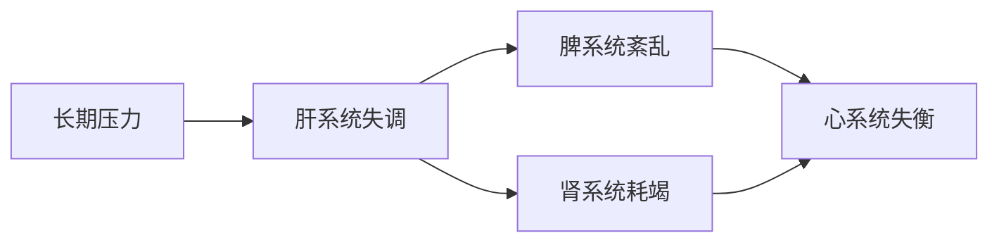

# 五脏-现代生理系统整合模型

## 模型概述

本模型旨在构建一座连接中医整体观、功能观与现代系统生物学的桥梁。它不追求简单的器官对照，而是致力于揭示中医"五脏"核心功能在现代人体中对应的**核心生理系统与关键调控网络**，从而为复杂疾病的理解、预防与整合治疗提供全新的框架。

## 核心原则

- **系统对系统原则**：一个中医脏腑对应一个关键的现代生理"功能系统"，而非单一解剖器官
- **功能驱动原则**：对应关系的建立基于**功能匹配的深度与广度**
- **动态交互原则**：各系统之间通过明确的生理通路进行实时、动态的交互

## 核心对应关系

### 脾 → 肠道微生物生态系统

**核心功能关联**：后天之本，运化水谷精微

**关键生理组件**：
- 肠道菌群
- 肠粘膜屏障
- 肠道相关淋巴组织(GALT)
- 肠神经系统
- 营养感应机制
- 短链脂肪酸(SCFAs)等代谢物

### 肝 → 神经内分泌压力调控网络

**核心功能关联**：主疏泄，调畅气机

**关键生理组件**：
- 下丘脑-垂体-肾上腺轴(HPA轴)
- 自主神经系统
- 边缘系统(情绪中枢)
- 核心神经递质与压力激素

### 心 → 心血管与高级神经中枢整合系统

**核心功能关联**：主血脉，藏神

**关键生理组件**：
- 心脏泵血系统
- 心血管循环
- 心脏内在神经系统
- "心脑对话"通路
- 前额叶皮层-边缘系统环路

### 肺 → 呼吸与胸腔动力系统

**核心功能关联**：主气，司呼吸，朝百脉

**关键生理组件**：
- 肺泡气体交换
- 呼吸肌
- 胸腔内压变化
- 肺循环
- 呼吸道粘膜免疫
- 肺肠轴

### 肾 → 骨髓与神经中枢生命根基系统

**核心功能关联**：藏精，主生殖发育，主骨生髓

**关键生理组件**：
- 骨髓干细胞
- 造血系统
- 下丘脑-垂体-性腺/甲状腺/肾上腺轴
- 中枢神经系统干细胞
- 表观遗传调控

## 模型优势

### 1. 系统性叙事能力
将碎片化的研究发现整合成有逻辑的生理叙事：

> **传统研究**："研究发现肾虚与下丘脑-垂体-靶腺轴功能紊乱有关"
>
> **本模型叙事**："肾-生命根基系统的功能衰退，会通过HPG/HPT/HPA轴，导致肝-压力调控网络的储备不足，并减少对心-整合系统的能量支持"

### 2. 临床推导能力
为复杂疾病提供系统性诊疗思路：

### 3. 科研假说生成能力
产生可验证的跨学科研究命题：

> "通过调节脾-肠道生态系统，应能测量到肝-压力调控网络和心-整合系统的功能性改善"

## 应用场景

- **整合医学**：为复杂慢性病提供诊疗框架
- **健康管理**：指导个性化健康干预方案
- **科学研究**：生成可验证的跨学科研究假说
- **医学教育**：搭建中西医沟通的理解桥梁

## 项目路线图

- [ ] 完善理论基础和文献支持
- [ ] 收集临床验证案例
- [ ] 开发评估工具和量表
- [ ] 建立协作研究网络

## 贡献指南

- 临床案例分享和验证
- 相关文献和研究证据
- 模型改进建议
- 应用实践反馈

## 许可证

本项目采用 MIT 许可证。
